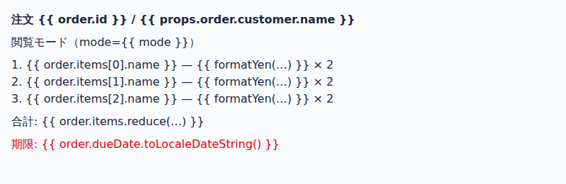
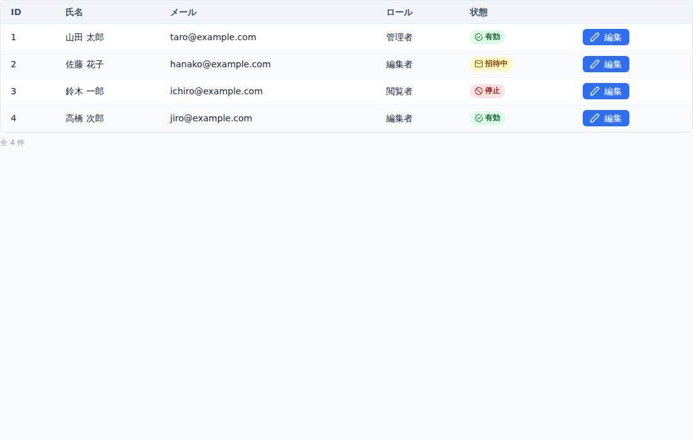
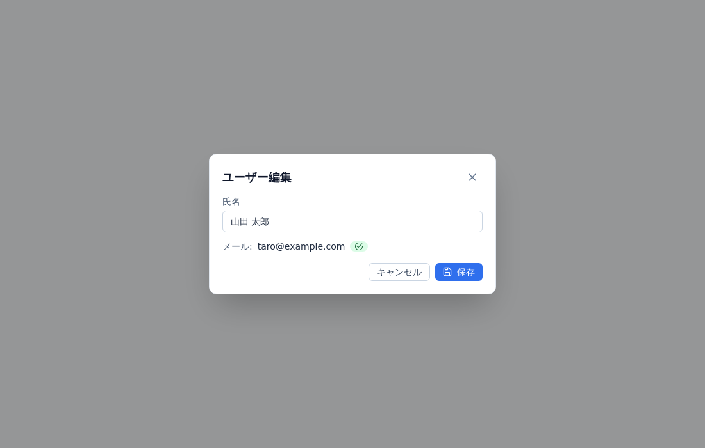
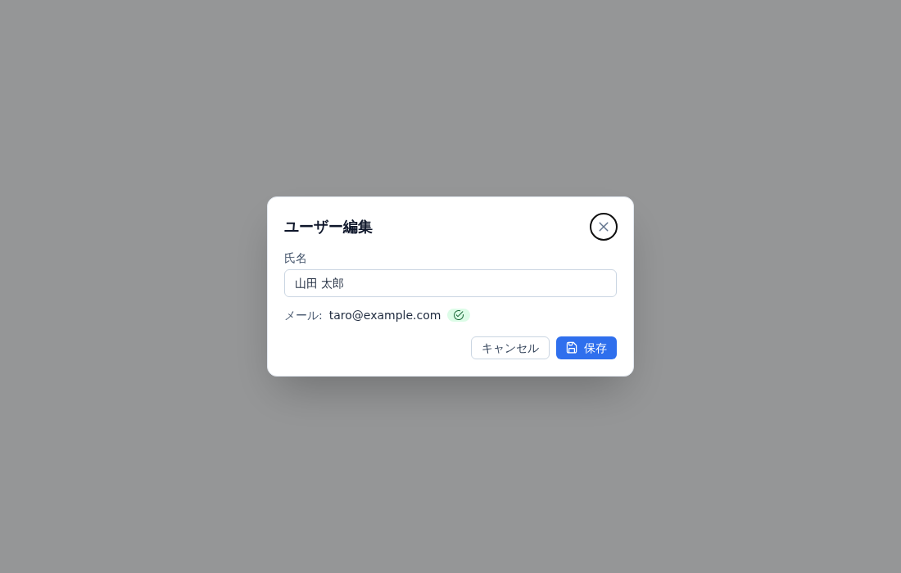
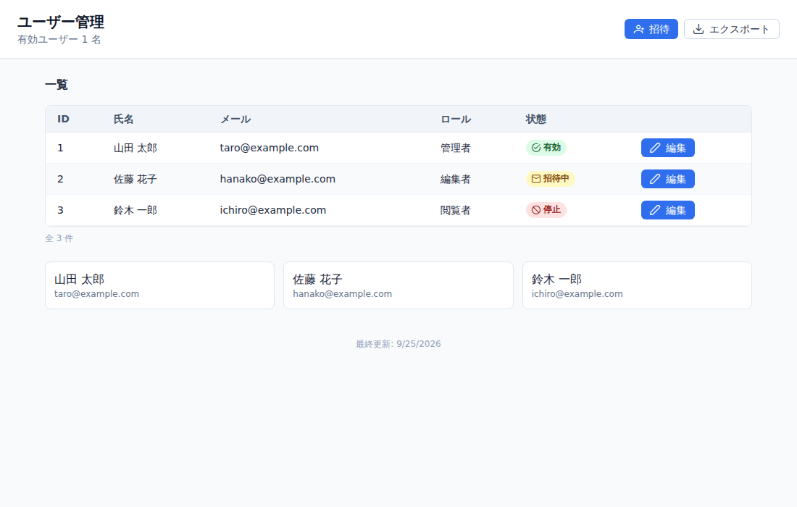

# vue-preview 検証レポート

方式を確かめるための検証（V1〜V6）から始め、pike から実際のアプリを描いて見つかった課題（V7 以降）を足してきた記録です。v0.6.0 まで公開しており、pike 0.58.0 のエディタの Preview（Vue の描画・値を仮に入れるフォーム・インストールの案内）がこの CLI を使っています。

V1〜V6 の検証日: 2026-09-25（V7 以降は各節に書きます）
検証環境: Linux x64 / Docker 29.3 / `node:22`（Debian）/ `oven/bun:1`（Bun 1.4.2）

| パッケージ | バージョン（fixture-app にインストール） |
| --- | --- |
| vue / @vue/compiler-sfc / @vue/server-renderer | 3.5.43 |
| primevue | 4.5.5（unstyled + pt） |
| tailwindcss / @tailwindcss/node / @tailwindcss/oxide | 4.3.3 |
| primeicons | 7.0.0 |
| vite / @vitejs/plugin-vue | 7.3.6 / 6.0.9 |

## サマリ

| 項目 | 結果 | 一言 |
| --- | --- | --- |
| V1 バイナリからのモジュール読み込み | **条件付きで成立** | `--compile-autoload-package-json` を付けてビルドすれば成立する。付けないとネストした依存を解決できない |
| V2 script を実行しないテンプレート SSR | **成立** | 全 binding を `$setup` に寄せ、ctx Proxy で値を供給する。プレースホルダ用に Vue ヘルパーを 2 系統シムした |
| V3 子コンポーネントの再帰解決 | **成立** | 相対 / `@/` / パッケージ import、名前付き slot、循環検知、深さ上限、スタブ化を確認 |
| V4 PrimeVue v4 unstyled + pt の SSR | **条件付きで成立** | DataTable は問題なし。Dialog は Portal が SSR で空になるため、Portal にパッチを当てる必要がある |
| V5 CSS インライン化 | **成立** | scoped / global / Tailwind v4（oxide ネイティブも可）/ primeicons の data URI 化 |
| V6 出力とパフォーマンス | **成立** | 外部リクエスト 0 件。Vite との画素差分は 0〜0.04%。1 回あたり約 0.6〜1.0 秒 |
| V7 node_modules が無いときの依存キャッシュ | **成立** | ロックファイルから埋め込みの bun で入れ、`NODE_PATH` 付きで起動し直す。Windows 版でも描けた |
| V8 設定ファイルが無いプロジェクト | **成立** | 書かれていないキーをエントリ（`src/main.ts`）の静的な読み取りで補う。PrimeVue を入れ忘れて真っ白になるのを防ぐ |
| V9 vite.config にしか無い alias | **成立** | tsconfig に `paths` が無ければ、vite.config の `resolve.alias` をテキストとして読む |
| V10 グローバル登録と自動 import の子コンポーネント | **成立** | エントリの `app.component(...)` と `components.d.ts` から、タグ名と定義元の対応を作る |
| V11 プレースホルダの表示 | **成立** | 参照式の末尾だけを表示し、全体はホバー（`title`）で出す |
| V12 fixture で与えられる値の一覧 | **成立** | `--json` の `inputs` に、ルートの props と、描画中にテンプレートが参照した値を出す |
| V13 i18n の簡易対応 | **成立** | `src/i18n/ja.ts` などのメッセージファイルを読み、`$t('key')` と `useI18n()` の `t` を訳す |
| V14 index.html で読み込むグローバル CSS | **成立** | `index.html` の `<link rel="stylesheet">` を、エントリの CSS より前に `globalCss` へ入れる。`/…` は `public/` の下 |

結論として、この方式は成立します。前提から外れた点は 2 つあります。

1. `bun build --compile` にフラグを 1 つ追加する必要がある（V1）。
2. PrimeVue の Portal を実行時にパッチする必要がある（V4）。

どちらも回避策が確立しており、設計の根幹は変わりません。

---

## 実行方法

コマンドは AGENTS.md の「開発コマンド」、CLI のオプションと `--json` の出力は DESIGN.md の「CLI」を参照してください。

- 検証サンドボックスではコンテナの外部通信にホストのプロキシが必要だったため、`docker-compose.override.yml`（git 管理外）で `network_mode: host`、`HTTPS_PROXY`、CA を追加しました。通常の環境ではこのファイルは不要です。
- 比較用の Vite dev サーバは `docker compose exec app npx vite --host 0.0.0.0` で起動し、`http://localhost:5173/compare.html?c=UserTable` を開きます（`src/compare.ts` が fixture と同じデータで 1 コンポーネントをマウントします）。

---

## V1: コンパイル済みバイナリからプロジェクトのモジュールを読み込めるか

**結果: 条件付きで成立**（`bun build --compile --compile-autoload-package-json` が必須）

### 根拠
- `Bun.resolveSync(spec, "<root>/")` で解決し、動的 `import()` で読み込めました。`vue` は `/app/node_modules/vue/index.mjs`（ESM 条件）に解決されます。

  ```json
  "vue": "/app/node_modules/vue/index.mjs",
  "@vue/compiler-sfc": "/app/node_modules/@vue/compiler-sfc/dist/compiler-sfc.cjs.js",
  "@vue/server-renderer": "/app/node_modules/@vue/server-renderer/index.js",
  "vue (from @vue/server-renderer)": "/app/node_modules/vue/index.mjs",
  "vue (from primevue/config)": "/app/node_modules/vue/index.mjs"
  ```
- **Vue は単一インスタンス**
  - ツール、`@vue/server-renderer`、`primevue` の 3 か所から `vue` を解決すると、同じファイルになりました。
  - プローブで比べた結果、ツールが import した `vue` と primevue 側から解決した `vue` は、モジュール名前空間オブジェクトとして同一でした（`===` が true）。
  - `createSSRApp(...).use(PrimeVue, { unstyled: true, pt })` のあと、PrimeVue 内部の `inject` 経由で `$primevue.config.pt` が参照され、pt のクラスが出力 HTML に反映されました。インスタンスが二重なら `getCurrentInstance()` が別物になり、ここは機能しません。
- `fixture-app/src/pt/preset.ts`（TS）は、バイナリから `import("/app/src/pt/preset.ts")` で直接読み込めました。Bun が実行時にトランスパイルします。

### ハマりどころ（想定との違い）
- **`--compile` の既定ビルドでは、ネストした依存の bare specifier を解決できない。**
  - トップレベルの `Bun.resolveSync('vue', root)` は成功します。ところが `vue` の読み込み中に `compiler-core` が `require('@babel/parser')` した時点で `Cannot find module` になりました。`primevue/datatable` → `@primeuix/utils` も同じ失敗です。
  - 同じコードを `bun run` で実行すると成功します。したがって問題はコンパイル済みバイナリに固有です。
  - 原因: `bun build --help` によると `--compile-autoload-package-json` の既定値が **false** で、スタンドアロン実行ファイルは実行時に package.json を読みません。そのため `exports` / `main` を解いてパッケージを特定できていませんでした。
  - `--compile-autoload-package-json` を付けてビルドすると、すべて解決できました。`NODE_PATH` を指定しても効果はありませんでした。
  - 代替案（ツールを npm パッケージとして node / bun で実行する）は、今回は不要になりました。
- `vue/index.js` は `process.env.NODE_ENV` で dev / prod ビルドを切り替えます。バイナリでは未設定なので、**dev ビルド**（警告あり）が読み込まれます。警告は `app.config.warnHandler` で `warnings` に集約しています。
- バイナリのサイズは約 81 MB（Bun ランタイム込み）です。

### 計測値
- `loadModules`（vue, compiler-sfc, server-renderer, primevue/config, pt preset）: warm で約 90〜105 ms、drop_caches 後で約 130〜160 ms。

---

## V2: script を実行せずにテンプレートだけを SSR できるか

**結果: 成立**

### 方式
1. `parse` → `compileScript(descriptor, { inlineTemplate: false, fs })` で次を得ます。生成コードは**実行しません**。
   - `bindings`（bindingMetadata）
   - `imports`（ローカル名 → source / imported）
   - props 宣言: 生成コード中の `props: {...}` を Babel AST で静的解析します。`type` と、リテラルの `default` だけを取り出します。`_mergeDefaults` / `_mergeModels` にも対応しています。
   - `scriptSetupAst` から、`defineModel` のローカル名 → prop 名と、`const props = defineProps()` のローカル名
2. `compileTemplate` は非 inline で呼び、`compilerOptions: { mode: 'function', prefixIdentifiers: true, bindingMetadata }` を渡します。
   - 生成されるのは `const {...} = Vue; return function render(_ctx, _cache, $props, $setup, ...)` という形です。`new Function('Vue', code)(vue)` で render 関数を取り出すので、一時ファイルは要りません。
   - **bindingMetadata のうち `props` / `props-aliased` / `data` / `options` は `setup-maybe-ref` に書き換えます。** こうするとテンプレートからの参照がすべて `$setup.x` になり、ctx Proxy が値の出どころを一元的に決められます。
3. `setup()` から ctx Proxy を返します。値の解決順は次のとおりです。
   1. 親から実際に渡された props（`vnode.props` にキーがある場合だけ `instance.props` を採用）
   2. 解決済みの import（子コンポーネント、ライブラリの値）
   3. fixture（ルートコンポーネントのみ）
   4. `defineProps` のデフォルト値（リテラルのみ）。Boolean 型でデフォルトがない場合は `false`（Vue の Boolean キャストに合わせる）
   5. **（追加）静的リテラルの初期値**: `ref(false)`、`ref([])`、`const labels = { ... }` のように、リテラルとして静的に評価できるもの。これはスコープの拡張です。StatusBadge の `icons[status]` のようなラベル表や、`dialogVisible = ref(false)` を再現するために入れました。
   6. プレースホルダ
4. `$props.x` の代わりに `props.x`（`const props = defineProps()`）と書かれていても、同じ順序で解決します。

### プレースホルダ
`placeholder.ts`: 関数を target にした Proxy です。
- 文字列化すると `{{ order.items[0].name }}` のような参照式になります（表示は V11 で末尾だけに変えました）。
- プロパティアクセスを連鎖でき、呼び出すと `{{ formatYen(…) }}` を返します。
- `Symbol.iterator` で 3 件を返します。
- `Symbol.toPrimitive('number')` は 1 です。
- `length` は 3 です。
- `then` / `__v*` / `constructor` などは `undefined` を返します。これを怠ると Vue が Promise や ref と誤認します。

### 根拠
- `StatusBadge` / `UserTable` / `EditDialog` / `UserPage` / `edge/PlaceholderDemo` の `<script setup>` には、先頭で `throw` する副作用を仕込んであります。それでも全画面を描画できました。
- `edge/PlaceholderDemo.vue` では、実行されると throw するプロジェクト内 TS（`src/utils/format.ts`）を import しています。これも実行されず、プレースホルダ化と warning の記録を確認しました。
- `v-if` / `v-else-if` / `v-else`、`v-for`（fixture の配列、プレースホルダの 3 件）、補間、`v-bind`（属性、`:class` のオブジェクト構文、テンプレートリテラル）、`v-model`（代入は ctx 側で受けて捨てる）が破綻しないことを確認しました。



### ハマりどころ
- **setup の戻り値に `then` があると Promise 扱いされる。** ctx Proxy が `then` にプレースホルダを返していたため、Vue が async setup と判定して落ちました。`then` は `undefined` を返すように修正しました。
- **関数型のプレースホルダは、Vue の 2 か所で別扱いされる。**
  - `renderList()` は関数を反復しないので、`v-for` が 0 件になりました。
  - SSR は関数値の属性を捨てるので、`:data-x="foo"` が消えました。
  - 対策として、**ツールがコンパイルした render 関数に渡す `Vue` だけ**をシムしました。`renderList` はプレースホルダを配列に展開し、`createElementVNode` 系は要素の属性値を文字列化します。ライブラリのコンポーネントには影響しません。
- **ライブラリのコンポーネントにプレースホルダを渡すと壊れることがある。** DataTable の `:value` にプレースホルダを渡すと型エラーの警告が出て、行が描画されませんでした。
  - 対策として、`createVNode` のシムで、渡し先コンポーネントの props 宣言（`extends` / `mixins` をたどる）を見て変換します。Array なら 3 件の配列、String なら文字列、Number なら 1、Boolean なら true です。
  - これでプレースホルダのみでも DataTable に 3 行が出ます。ただし `rowData`（Object 型）のように変換しない prop については、dev の型警告が残ります。
- `compileTemplate` の `scopeId` オプションは module モード専用です（function モードでは警告が出る）。scoped の `data-v-*` は、コンポーネントに `__scopeId` を持たせれば実行時に付与されるので、コンパイラ側には渡していません。
- `transformAssetUrls` は無効にしています（`` は import 文に変換されるため）。画像アセットのインライン化は未対応です。

### 計測値
- 6 SFC（UserPage 一式）の `compileSfc` 合計: 約 110 ms（初回呼び出しの JIT 込み）

---

## V3: 子コンポーネントの再帰解決

**結果: 成立**

### 根拠
- `UserPage` の構成は `PageLayout`（`@/`）、`UserTable`（`@/`）、`EditDialog`（`./`）、`AppButton`（`@/volt`）で、さらに `StatusBadge`（`./` と `@/` の両方から import）を含みます。これらを再帰的に V2 と同じ方式でコンパイルして供給しました。`deps` にもすべて記録されます。
- パッケージからの import（`primevue/datatable` / `column` / `dialog` / `inputtext` / `button`）は、プロジェクトの node_modules から本物を読み込んでいます。
- 名前付き slot は親のコンテキストで描画されました。
  - `PageLayout` の `#actions` / 既定 / `#footer`
  - DataTable の `Column #body="{ data }"` の中の `StatusBadge` / `AppButton`
  - `Dialog #footer`
- 循環参照: `edge/CircularA → CircularB → CircularA` を検知してスタブ化し、次の warning を記録しました。
  `stub <CircularA>: circular import (src/components/edge/CircularA.vue -> src/components/edge/CircularB.vue -> src/components/edge/CircularA.vue)`
- 深さの上限は `maxDepth`（既定 20。設定で変更可）です。超えた場合もスタブになります。
- 解決できないもの（`edge/Unresolved.vue`）:
  - 存在しない `./DoesNotExist.vue` → スタブ（既定 slot の中身も表示）と warning
  - import もグローバル登録もない `<FancyWidget>` → スタブと warning
  - import のない `<Tag>` → `primevue/tag` として自動解決しました。PrimeVue をグローバル登録や resolver で使うプロジェクトを想定した補助です。
- `componentDirs` を指定すると、import されていないタグを `<dir>/<PascalName>.vue` から探します。

### ハマりどころ
- 同じ SFC を複数の場所から import しても、コンパイルと定義は 1 回だけです（ファイルパスでキャッシュ）。ルートだけは fixture を持つので、キャッシュしません。
- `import UserTable, { type User } from '...vue'` のような型 import は `isType` で除外しています。SFC の `<script>` の名前付き値 export は script コードなので実行せず、プレースホルダにします。
- 再帰コンポーネント（ツリー表示など、自分自身を import するもの）も循環としてスタブになります。プレースホルダの配列は常に 3 件なので、再帰を許すと停止しません。これは仕様上の制約です。

---

## V4: PrimeVue v4 unstyled + pt の SSR

**結果: 条件付きで成立**（Dialog などの Portal 系は、Portal へのパッチが必要）

### 根拠
- `createSSRApp(root).use(PrimeVue, { unstyled: true, pt })` で描画しました（pt は `src/pt/preset.ts` を実行して取得）。
- `UserTable.vue`（DataTable）では、fixture の 4 行が描画されました。`tableContainer` / `table` / `thead` / `bodyRow` / `column.headerCell` / `column.bodyCell` など、pt 由来の Tailwind クラスが HTML に出力されます。
- `EditDialog.vue`（Dialog、fixture で `visible: true`）が描画されました。`renderToString` の `ssrContext.teleports['body']` から取り出し、`</body>` の直前に差し込んでいます。
- Volt 風ラッパー: `src/volt/AppButton.vue` は PrimeVue Button をプロジェクト内 SFC でラップし、独自の `pt` と `ptOptions` を持たせたものです。ツールでは V2 の方式でコンパイルされ、中身の Button は本物が使われます。どちらも問題なく描画されました。

### ハマりどころ（想定どおりの問題）
- **PrimeVue の Portal は、マウント後にしか描画しない実装。** `primevue/portal/index.mjs` の該当部分:

  ```js
  data() { return { mounted: false } },
  mounted() { this.mounted = isClient() },
  render: inline ? renderSlot(...) : mounted ? h(Teleport, { to: appendTo }, ...) : createCommentVNode()
  ```

  SSR では `mounted` フックが走らないので、Dialog は `<!---->` になります。`--portal off` で出力が空になることも確認しました。
- 回避策を 2 つ試し、どちらも成立しました（Portal は Dialog から `components: { Portal }` でローカル登録されているため、`app.component` による差し替えは効きません。モジュールの default export を直接書き換えています）。
  1. **teleport（既定）**: `Portal.data` をラップして `mounted: true` で始めます。実際に `<Teleport to="body">` が生成され、SSR の `teleports` から取り出して body 末尾に差し込みます。ブラウザでの配置に近い結果になります。
  2. **inline**: `Portal.computed.inline` を常に true にします。`appendTo: "self"` と同じ扱いで、その場に描画されます。コンポーネント単位で `appendTo="self"` を書かせる必要はありません。
- Dialog の中身の表示判定は `data.containerVisible = this.visible` なので、初期値の時点で `visible: true` が反映されます。`Transition` は SSR では子要素をそのまま出すので、追加対応は不要でした。
- fixture 側で見つけた不具合: 当初 `AppButton` に `ptOptions: { mergeProps: true }` を付けていたため、グローバル pt の `text-white` と自前の `text-slate-700` がマージされ、「キャンセル」ボタンの文字が白地に白で見えなくなっていました。**Vite でも同じ見た目だった**ので、プレビューは実物どおりです。fixture の方を `mergeProps: false` に直しました。
- 出力には PrimeVue 由来の属性（`data-pc-*`、`data-p-*`、`pcN`）と、SSR のハイドレーション用コメント（`<!--[-->`）が大量に含まれます。見た目には影響しません。

---

## V5: CSS のインライン化

**結果: 成立**

### 根拠
- **scoped CSS**:
  - `compileStyle({ id: 'data-v-<hash>', scoped: true })` で生成しました。ハッシュはルート相対パスの sha256 の先頭 8 桁です。
  - コンポーネント定義に `__scopeId` を持たせ、描画された要素に `data-v-7100860d` などが付くことを確認しました。
  - slot に渡した中身には、Vue SSR の仕様どおり `data-v-xxx-s` も付きます。
- **グローバル CSS**: 設定の `globalCss` を読み込みます。
  - パッケージ指定（`primeicons/primeicons.css`）にも対応しました。ツールは `main.ts` を実行しないので、この時点では設定へ列挙する方式にしました。設定に書かれていないときの推測は、V8（エントリの CSS の import）と V14（`index.html` の link）で足しています。
  - `tailwind.entry` と同じファイルは、Tailwind の出力と重複するのでスキップします。
- **Tailwind v4**:
  - `@tailwindcss/node` の `compile(css, { base, from, onDependency })` → `build(candidates)` で生成しました。インストール済み 4.3.3 の `index.d.ts` で API を確認しています。
  - 想定との違いは、`onDependency` が**必須**だった点だけです。
  - `@import "tailwindcss"` と `@theme` による独自色（`bg-brand-500`）、`@apply` も正しく展開されました。
- **oxide（ネイティブバインディング）はバイナリから読み込めました。**
  - `@tailwindcss/oxide` → `@tailwindcss/oxide-linux-x64-gnu` の `.node` を `import()` できます。
  - `new Scanner({ sources: [] }).getCandidatesWithPositions({ content: html, extension: 'html' })` で、出力 HTML からクラス候補を抽出しました（UserPage で 150 候補）。
  - 念のため、oxide が使えない場合は `class="..."` を分割する自前の抽出にフォールバックします。
- **primeicons**:
  - `url()` を data URI に置き換えました。
  - `@font-face` に woff2 がある場合は woff2 だけを残します。eot / ttf / svg / woff をすべて埋めると約 800 KB 増えるためです。
  - スクリーンショットでもアイコンが表示されています。

### 計測値
- `css`（Tailwind のコンパイル・生成、primeicons の読み込み・インライン化、scoped の結合）: 約 105〜170 ms
- 出力サイズ（UserPage）: HTML 全体で 90 KB。内訳は primeicons（woff2 の data URI 込み）64 KB、Tailwind 11 KB、scoped 0.6 KB です。

---

## V6: 出力とパフォーマンス

**結果: 成立**

### 外部リソース
`out/*.html` を Playwright（Chromium）の `file://` で開き、`request` イベントを数えました。

| 画面 | preview のリクエスト数 | Vite dev のリクエスト数 |
| --- | --- | --- |
| UserTable | **0** | 28 |
| EditDialog | **0** | 28 |
| UserPage | **0** | 34 |

### Vite dev サーバとの見た目の差分
スクリーンショットは 1100×700 です。差分はブラウザの canvas で画素単位に比較しました。

| 画面 | 差分画素 | 内容 |
| --- | --- | --- |
| UserTable | 0（0%） | 完全一致 |
| UserPage | 0（0%） | 完全一致 |
| EditDialog | 309（0.04%） | Vite 側だけ、Dialog 表示後に閉じるボタンへフォーカスが移ってリングが出る（クライアント側の挙動）。それ以外は一致 |

| preview（vue-preview） | Vite dev |
| --- | --- |
|  |  |
|  |  |
|  |  |

Vite 側の比較ページ（`compare.html`）は fixture の値を props として渡します。`UserPage` は `fetch` をモックして fixture の `users` を返します。この条件で、プレビューと Vite が同じ状態を描画することを確認しました。

### 実行時間
`docker compose exec app /opt/vue-preview/vue-preview render src/components/UserPage.vue --root /app --json` を計測しました（当時のバイナリ名。今は `vue-preview-linux-x64`）。「cold」は各回の前に `echo 3 > /proc/sys/vm/drop_caches` でページキャッシュを捨てています。

| | wall（compose exec 込み） | 内部合計 | loadModules | compile | ssr | css |
| --- | --- | --- | --- | --- | --- | --- |
| cold #1 | 977 ms | 613 | 161 | 173 | 119 | 158 |
| cold #2 | 937 ms | 587 | 130 | 176 | 119 | 161 |
| cold #3 | 839 ms | 558 | 140 | 167 | 107 | 143 |
| cold #4 | 913 ms | 616 | 143 | 190 | 110 | 173 |
| cold #5 | 870 ms | 565 | 132 | 178 | 106 | 148 |
| warm（5 回の範囲） | 610–666 ms | 430–473 | 89–106 | 138–151 | 96–103 | 106–135 |

- さらに細かい内訳（warm）:
  - compile のうち SFC コンパイルが約 110 ms、PrimeVue コンポーネントの import が約 30 ms
  - SSR は 1 回目が約 97 ms、同じアプリの 2 回目が約 40 ms
- `docker compose exec` 自体のオーバーヘッドは約 50〜100 ms です（`docker exec` 直叩きでは 556〜579 ms）。
- 内部合計と wall の差は、残りの 150〜250 ms 程度です。これは 81 MB バイナリの起動とコンテナ exec によるものです。

### 常駐モード（`serve`）の判断材料
- 毎回かかる固定費はおよそ次のとおりです。
  - プロセス起動と exec: 約 150〜250 ms
  - モジュール読み込み: 約 100〜160 ms
  - コンパイラと SSR の JIT ウォームアップ: SFC コンパイル約 110 ms のうち大半と、SSR の約 60 ms
  - Tailwind のコンパイラ初期化
- 常駐して変更があった SFC だけを再コンパイルすれば、1 回あたり **100 ms 前後**まで下がる見込みです。SSR の 2 回目は 40 ms で、SFC 単位のキャッシュも効きます。
- 保存のたびにプレビューを更新する用途なら、常駐は**あった方がよい**です。一方、手動で開く用途なら 1 秒弱は実用範囲です。まず単発の CLI で統合し、`serve` は必要になってから足すのが妥当です。
- pike には単発の CLI で統合しました（保存のたびに `render --json` を起動します）。`serve` は未実装です。

---

## V7: プロジェクトに node_modules が無いときの依存キャッシュ

検証日: 2026-09-26（Linux x64 の `node:22` / `debian:bookworm-slim`、Windows 11 のホスト）

**結果: 成立**（ロックファイルから埋め込みの bun で入れ、`NODE_PATH` 付きで自分を起動し直す）

pike から呼ぶとき、node_modules がコンテナの中にしか無い構成（DESIGN の前提そのもの）では、ホストのシェルから実行できません。そこで、プロジェクトで `vue` を解決できないときは、ロックファイルどおりの依存をキャッシュへ入れて使うようにしました。

### 根拠
- **コンパイル済みバイナリは `BUN_BE_BUN=1` で bun CLI として動く。** node と npm の無い `debian:bookworm-slim` で `BUN_BE_BUN=1 vue-preview install --frozen-lockfile` が通りました。`package-lock.json` を移行し、fixture-app と同じ版（vue 3.5.43 / primevue 4.5.5 / tailwindcss 4.3.3）が入ります。
- ネイティブ依存は、実行したホスト向けのものが入ります（Linux は `oxide-linux-x64-gnu`、Windows は `oxide-win32-x64-msvc`）。
- **キャッシュの node_modules は `NODE_PATH` で解決できる。** プロジェクトのファイル（pt の preset）が native に import する `vue` / `primevue/*` と、その先のネストした依存の両方を解決できました。`--compile-autoload-package-json` は、ここでも必須です。
- e2e では、node_modules の無い `bare` コンテナで描いた HTML が、プロジェクトの node_modules で描いた HTML と**バイト単位で一致**しました（UserPage / UserTable）。
- Windows 版（`--target=bun-windows-x64` のクロスビルド）も、Windows のホストで fixture-app を描けました。UserTable は Linux と同じ HTML になりました。UserPage は日付の表記（`toLocaleDateString` がロケールに従う）だけが違いました。scoped の hash は、ルート相対パスの区切りを `/` にそろえたので、OS をまたいで一致します。

### ハマりどころ（想定との違い）
- **実行中に `process.env.NODE_PATH` を設定しても解決に反映されない。** 起動時にしか読まれないため、`NODE_PATH` と `VUE_PREVIEW_DEPS_DIR` を付けて自分を起動し直しています。
- **Bun の実行時プラグイン（`Bun.plugin` の `onResolve`）は、コンパイル済みバイナリの動的 `import()` では呼ばれない。** 解決をフックする案は採れませんでした。
- **CA 証明書の無い環境では、install が何も出力せずに失敗した**（`debian:bookworm-slim` の素の状態）。`ca-certificates` を入れると通りました。公式の `node` イメージと通常のホストには入っています。

### 計測値
| 環境 | 初回（install 込み） | 2 回目以降 |
| --- | --- | --- |
| WSL2 の Docker、`/mnt/c` 上 | 22〜29 秒（install のみ） | 通常の描画と同じ |
| Windows 11 のホスト | 8.7 秒 | 0.56 秒 |

- 起動し直す分のコストは、2 回目以降の 0.56 秒に含まれています。

### 仕様として決めたこと
- ロックファイルが無いとき、ルートの package.json に `workspaces` があるとき（monorepo）はエラーにします。版のずれた描画は出しません。
- キャッシュのキーは、package.json・ロックファイル・`.npmrc` の内容、OS と arch、bun の版から作ります。一時ディレクトリへ入れてから rename するので、同時に実行されても中途半端なキャッシュは残りません。30 日使われなかったエントリは、次に install したときに消します。

---

## V8: 設定ファイルが無いプロジェクト

検証日: 2026-09-26（pike から実際の業務アプリを開いて確認）

**結果: 成立**（書かれていないキーを、アプリのエントリの静的な読み取りで補う）

### きっかけ
- 設定ファイルの無い業務アプリ（PrimeVue v4 unstyled + pt + Tailwind v4 の、このツールが想定する構成そのもの）を描くと、**真っ白**になりました。
- 原因は、設定が無いと PrimeVue をアプリに入れないことでした。PrimeVue のコンポーネントは描画中に `this.$primevue.config` を読むので、`TypeError` で落ちます（`Property "$primevue" was accessed during render but is not defined`）。
- 必要な情報（`unstyled` / `pt` / 読み込む CSS）は、どれもエントリ（`src/main.js`）に書いてありました。

### 根拠
- エントリをテキストとして読み、副作用の CSS の import・`primevue/config` の import 名・`app.use(<その名前>, { ... })` の `unstyled` と `pt` を取り出しました（`detect-config.ts`）。**エントリは実行しません。**
- e2e では、fixture-app から設定ファイルを外したルートで描いた `<body>` が、明示の設定で描いたものと一致しました（UserPage / UserTable）。CSS の並びはエントリの import 順になるため、`<head>` は一致しません。
- 業務アプリでも、設定ファイルを置かずに Checkbox を描け、警告は 0 件でした。

### 仕様として決めたこと
- 推測するのは設定に**書かれていない**キーだけです。`null` は「使わない」の明示なので推測しません。
- エントリに `app.use(PrimeVue, ...)` が見つからなくても、依存に `primevue` があれば PrimeVue 本来の既定（`unstyled: false`）で入れます。真っ白より、スタイルの無い描画のほうが役に立つためです。既定をエントリから読んだときと同じ値にそろえ、経路によって描画が変わらないようにしています。
- 読んだエントリは、何も推測できなかったときも `deps` に入れます（エントリを直したら呼び出し側が描き直せるように）。依存から PrimeVue を入れたときは `package.json` も入れます。

---

## V9: vite.config にしか無い alias

検証日: 2026-09-26（V8 と同じ業務アプリ）

**結果: 成立**（tsconfig に `paths` が無いときは、vite.config の `resolve.alias` をテキストとして読む）

### きっかけ
- JavaScript のプロジェクトには tsconfig が無く、`@` は vite.config の `resolve.alias`（`'@': path.resolve(__dirname, './src')`）にしか書かれていないことがあります。
- そのため `@/lib/...` の import がパッケージとして扱われ、`Cannot find package '@/lib'` の警告付きでスタブやプレースホルダになりました。

### 根拠
- vite.config は実行せず、`alias:` に続くオブジェクトまたは配列を括弧の対応で切り出して、キーと値の最初の文字列リテラルを読みました。`path.resolve(__dirname, './src')` と `fileURLToPath(new URL('./src', import.meta.url))` の両方で `./src` が取れます。
- e2e では、fixture-app から設定ファイルと tsconfig を外したルートで描いても警告は 0 件でした。HTML は tsconfig を使って描いたものと一致しました。
- 業務アプリでも `@/lib/...` を解決できました。残った警告は、プロジェクトの `.js` を実行しないことによる想定どおりのものだけです。

### 仕様として決めたこと
- 探す順は、設定の `aliases`、tsconfig の `paths`、vite.config の順です。混ぜずに、最初に見つかったものだけを使います。
- 読むのは、置き換え先がパスと分かるエントリだけです。`./` や `/` で始まる文字列か、`path.resolve` / `fileURLToPath` などで文字列リテラルから組み立てた値です。
  - `vue: 'vue/dist/vue.esm-bundler.js'` のようなパッケージの付け替えは読みません。読むと `import 'vue'` がプロジェクトのファイルとして扱われ、解決できずスタブになります。
  - `find` が正規表現のもの、置き換え先が変数やテンプレートリテラルのものも読みません。そのときは設定の `aliases` に書いてもらいます。
- エントリは、括弧とクォートを見ながら最上位のカンマで区切って 1 つずつ読みます。値の手前を正規表現で読み飛ばすと、値に文字列が無いエントリで隣のキーを置き換え先として拾ってしまうためです。
- alias の推測も、V8 の推測と同じ関数（`completeConfig`）で行います。推測したときは `config.detected` に `aliases` が出ます。

### ハマりどころ
- **コメントの除去は、文字列の中を見てはいけない。** 業務アプリの vite.config には `'src/**/*'` のような glob があり、正規表現で `/* ... */` を消すと、その `/*` から次の `*/` までの alias を含む範囲がまるごと消えました。文字列リテラルを飛ばしながら走査する形に直しました（`text-scan.ts` の `stripComments`）。
- 読んだ tsconfig / vite.config は `deps` に入れます（alias を変えたら呼び出し側が描き直せるように）。

---

## V10: グローバル登録と自動 import の子コンポーネント

検証日: 2026-09-26（V8 と同じ業務アプリ）

**結果: 成立**（タグ名と定義元の対応 `components` を、エントリの `app.component(...)` と `components.d.ts` から作る）

### きっかけ
- 業務アプリは、PrimeVue のコンポーネントを `app.component('pv-dialog', Dialog)` のように接頭辞付きの名前で登録し、プロジェクトのコンポーネントも `app.component('s-button', SButton)` で登録していました。
- 子コンポーネントはどれも import せずに使うので、V3 の解決（import を辿る）に載りません。未登録のタグの探索（`primevue/<name>`）でも `pv-dialog` は `primevue/pvdialog` になり、見つかりません。その結果、ダイアログやボタンが破線の箱（スタブ）になっていました。

### 根拠
- エントリの `app.component('名前', 識別子)` を読み、識別子の default import の元を辿りました。プロジェクトの SFC（alias 経由を含む）ならその SFC を、パッケージならその default export を使います。
- 自動 import（unplugin-vue-components / Nuxt）は、生成される `components.d.ts` に `Name: typeof import('...')['default']` の形で定義元が書かれているので、同じ対応に入れました。
- e2e では、`main.ts` でグローバル登録した SFC（`<app-badge>`）とパッケージのコンポーネント（`<pv-tag>`）を、設定ファイルの有無どちらでもスタブ無し、警告 0 件で描けました。
- 業務アプリのダイアログ（`pv-dialog`、`s-button`、`s-radio` などを使う）も、スタブが 0 件になりました。

### 仕様として決めたこと
- タグ名は PascalCase にそろえて引きます（`pv-button` と `PvButton` は同じ）。
- 探す順は `componentDirs`、`components`、`primevue/<name>` です。
- `app.component(Comp.name, Comp)` のように名前を式で渡すものと、ループで登録するものは読みません。そのときは設定の `components` に書いてもらいます。
- 推測に使った `components.d.ts` は、エントリが 0 件でも `deps` に入れます（開発サーバーが後から書き足すため）。
- 推測の段階ではファイルの有無を確かめません。Nuxt の `components.d.ts` は数百件あり、描画のたびに全件を確かめると固定費になるためです。タグを解決するときに、使われたものだけを通常の import と同じ経路で解決します。SFC でないもの（`.tsx` など）はプレースホルダ、見つからないものは理由付きのスタブになります。
- PrimeVue の `primevue/<name>` を探す決め打ちは残しています。`components` の仕組みに寄せて一般化するのは、次の候補です。

---

## V11: プレースホルダの表示

検証日: 2026-09-26（V8 と同じ業務アプリ）

**結果: 成立**（参照式の末尾だけを表示し、全体はホバーで出す）

### きっかけ
- プレースホルダは参照式をそのまま表示していたので、`{{ groups[0].items[0].name }}` のように長くなり、画面の見た目が崩れていました。

### 方式
- プレースホルダの文字列化では、参照式を私用領域の文字（U+E000 / U+E001）で挟んだ印を返します。SSR の後で HTML を 1 回走査し、印を置き換えます。
  - テキストの中は `<span class="vp-ph" title="groups[0].items[0].name">{{ name }}</span>` にします。
  - 属性値の中はホバーを付けられないので、`{{ name }}` だけにします。
- SSR は印の文字をそのまま通し、参照式の中の `"` などはテキストとして HTML エスケープ済みです。そのため `title` にそのまま入れられます。
- 警告の文面（Vue の警告が値を含む場合）では、印を `{{ 全体 }}` に戻します。
- span を入れられない場所では、`{{ 末尾 }}` の文字だけにします。
  - `<textarea>` の中：中身はマークアップではなく文字なので、span の文字列がそのまま表示されてしまいます。
  - `<svg>` の中：HTML の span は SVG の未知の要素になり、描画されません。
- 参照式は、SSR のテキストとしてはエスケープ済みですが、`v-html` 経由ではエスケープされていません。そこでいったんエンティティを戻し、属性とテキストのそれぞれに合わせてエスケープし直します。
- 添字も不明な値（`labels[status]`）では、添字のプレースホルダの印を外して `labels[status]` の参照式にします。印を入れ子にすると、対応が崩れて印の文字が HTML に残ります。
- 末尾は `.` で区切ったいちばん後ろです。ただし `row["user.name"]` のような文字列の添字は、引用の中身（`user.name`）をまとめて表示します。

### 根拠
- e2e では、テキストが `<span ... title="order.items[2].name">{{ name }}</span>`、属性が `data-order="{{ id }}"` になり、出力に印の文字が残らないことを確かめました。
- 業務アプリでも、`groups[0].items[0].name` が `{{ name }}` と表示され、ポイントすると全体が出ました。

---

## V12: fixture で与えられる値の一覧

検証日: 2026-09-26（V8 と同じ業務アプリ）

**結果: 成立**（`--json` の `inputs` に、ルートの props と、描画中にテンプレートが参照した値を出す）

### きっかけ
- pike のプレビューで、マウント時の値（props や `onMounted` で取るデータ）を仮に埋めたいという要望がありました。fixture を手で書く前に、何を書けばよいかが分かる必要があります。
- 業務アプリのダイアログは `modelValue` が false だと中身を描かないので、props を与えない限り何も表示されません。

### 方式
- props は、SFC の静的解析（V2）で得た宣言をそのまま出します。型と、リテラルの既定値です。
- props 以外の値は、ルートの ctx Proxy が識別子を解決するときに記録します（`CtxSources.inputs` に渡した `ComponentGraph.rootInputs`）。import の値と props を除いた、fixture が埋められる名前です。静的に読めない computed や、`onMounted` で入れる ref もここに並びます。
- 描画中に記録するので、並ぶのは実際に参照された名前だけです。`v-if` で描かれなかった部分の名前は、条件を満たす値を与えて描き直すと現れます。
- 関数呼び出しの戻り値から受け取った名前（`const { t } = useI18n()`、`const store = useProjectStore()`）には `origin: "call"` を付けます。pike のコンポーネントで一覧を見たところ、`t` やストア、composable の関数が普通の値と同じ並びに出て、JSON では意味のある値を与えにくい欄になっていました。`ref` / `computed` などのリアクティビティの呼び出しはコンポーネント自身の状態なので、印を付けません。

### 根拠
- e2e では、PlaceholderDemo の props（`order`、`showNote`）と値（`mode`）、UserTable が使った fixture を確かめました。
- 業務アプリのダイアログでは、props に `modelValue` などが並び、値は空でした（ダイアログが閉じているため）。
- pike は `inputs` から値を仮に入れるフォームを作り、入れた値を `--fixture` で渡して描き直します。`origin: "call"` の値は畳んだ群に分けています。

---

## V13: i18n の簡易対応

検証日: 2026-09-26（pike と、vue-i18n を使う別の業務アプリ）

**結果: 成立**（メッセージファイルを読み、`$t('key')` と `useI18n()` から受け取った `t` を訳す）

### きっかけ
- i18n を使うコンポーネントは、文言がすべて `{{ t }}` などのプレースホルダになり、画面の見た目を確かめられませんでした。V12 の `inputs` にも `t` が並び、値を入れる欄として意味がありませんでした。
- 対象は 2 通りあります。pike の自前実装（`src/i18n/ja.ts` の default export と `useI18n()` が返す `t`）と、vue-i18n（`src/i18n/ja.js` の `export const ja` と、テンプレートの `$t`）です。

### 方式
- プラグインは再現せず、メッセージだけを読みます。`src/i18n` / `src/locales` / `src/locale` / `src/lang` / `src/langs` のうち、ロケール名のファイル（`ja.ts`、`en.json`、`pt-BR.js` など。`index.js` は対象外）がある最初のディレクトリを使います。
- ロケールは `--locale`、設定の `i18n.locale`、`ja`、`en`、最初に見つかったもの、の順で決めます。日本語を優先するのは、利用者の画面が日本語だからです。
- **メッセージのモジュール（`.ts` / `.js`）は import して実行します。** pt 定義ファイル（V4）と同じ扱いの例外です。中身は文字列のオブジェクトなのが普通で、JSON に限ると `.ts` で書く pike も `.js` で書く vue-i18n の業務アプリも読めないためです。値は default export、ロケール名の export、唯一の export の順で取ります。
- `$t` はアプリのグローバルプロパティに入れます。`useI18n()` は script を実行しないので、分割代入の名前（`const { t, locale: l } = useI18n()`）を静的に読み、ctx Proxy が `t` / `locale` / オブジェクトを返します。これらは `inputs` に出ません。
- キーは入れ子のパス（`menu.open`）、次にフラットなキー（`'menu.open': ...`）の順で引きます。`{name}` と `{0}` を埋めます。見つからないキーは、vue-i18n と同じくキーそのものを表示します。
- 数を渡した呼び出し（`t('apples', 3)`）は、vue-i18n と同じ規則で `|` の分岐を選び、`{n}` と `{count}` を埋めます。日時や数値の書式と、`<i18n>` ブロックは扱いません。
- 検出した設定のパスは拡張子を持たない形（`src/i18n/{locale}`）にし、読むときにロケールごとの拡張子を探します。同じディレクトリでロケールごとに拡張子が違っても（`ja.ts` と `en.json`）、`--locale` で切り替えられます。

### 根拠
- e2e では、名前付き export の `ja.ts` と default export の `en.ts` を置いて、次を確かめました。
  - `$t` の埋め込み、入れ子とフラットのキー、見つからないキー
  - `--locale en` で英語になること
  - `inputs` に `t` が出ないこと
- pike の ProjectSwitcher は、検索欄の placeholder が「プロジェクトを検索...」になり、`inputs` から `t` が消えました。
- vue-i18n の業務アプリでは、`$t('select')` が「選択」になりました。`deps` には `src/i18n/ja.js` が入ります。

---

## V14: index.html で読み込むグローバル CSS

検証日: 2026-09-26（V13 と同じ vue-i18n の業務アプリ）

**結果: 成立**（ルートの `index.html` の `<link rel="stylesheet">` を、エントリの CSS の import より前に `globalCss` へ入れる）

### きっかけ
- 業務アプリは、共通の CSS を `index.html` の `<link href="/static/css/common.css">` で読み込んでいました。V8 の推測はエントリ（`src/main.js`）の import しか見ないので、この CSS がプレビューに入っていませんでした。
- `/static/...` は Vite が `public/` の中身をそのまま配信するパスで、ファイルの実体は `public/static/css/common.css` です。

### 方式
- `index.html` もエントリと同じくテキストとして読み、コメントを除いた `<link>` のうち `rel` に `stylesheet` を含むものの `href` を取ります。`rel="alternate stylesheet"`（テーマの切り替え先）は、ブラウザが既定では適用しないので除きます。
- `/` で始まる href は `public/` の下を先に探し、無ければルートの下を探します。`?v=2` などのクエリは外します。相対の href はルートからのパスです。
- 並び順は、`index.html` の link、エントリの import の順です。ブラウザも HTML の link を先に読むので、上書きの関係が同じになります。
- `http(s):` と `//` の外部 CSS は取り込みません。出力を 1 枚で完結させる方針（V6）のためで、warning に出します。
- CSS の中の `url(/img/a.png)` も、同じ規則（`public/` の下、無ければルートの下）で探すようにしました。これまではファイルシステムのルートを探して見つからず、warning になっていました。
- `<script src>` で読み込む JS（Font Awesome の JS 版など）は、実行して DOM を書き換える仕組みなので扱いません。

### 根拠
- e2e では、fixture-app の `index.html` に `public/static/linked.css` への link を置き、設定ファイルなしの描画でその CSS が入り、`deps` に `index.html` と CSS が入ることを確かめました。
- 業務アプリでは、`deps` に `index.html` と `public/static/css/common.css` が入り、warning は出ませんでした。

---

## 既知の制約・提案（スコープ外のため記録のみ）

- **script を実行しないことの限界**:
  - computed / 関数呼び出しの結果は、fixture で与えない限りプレースホルダになります（例: `activeCount`）。
  - UserPage の fixture には、`users` と `activeCount` を両方書く必要があります。
  - `onMounted` などのライフサイクルで取得するデータは、fixture で与えるのが前提です。
- **プレースホルダの限界**:
  - プレースホルダをキーにしたオブジェクト参照（`labels[status]`）は `undefined` になります。
  - `===` による比較は常に false になるので、`v-if="mode === 'edit'"` は v-else 側に倒れます。
- `<style lang="scss">` などのプリプロセッサは未対応です（warning でスキップ）。`transformAssetUrls` を無効にしているので、画像も表示されません。
- `main.ts` の `app.use()` / `app.provide()` は再現しません。PrimeVue 以外のプラグイン（router、pinia）を使うテンプレートは、`$route` などがプレースホルダか描画エラーになります。i18n はメッセージだけを読む簡易対応（V13）です。設定でプラグインの「プレビュー用初期化モジュール」を指定できるようにする案が考えられます。
- Portal へのパッチは PrimeVue の内部実装（`data.mounted` / `computed.inline`）に依存します。PrimeVue の更新で壊れる可能性があるので、バージョンを固定するか、壊れたことを検知する仕組みが必要です。
- 出力を小さくするなら、`data-pc-*` 属性とハイドレーション用コメントの除去、primeicons の未使用グリフのサブセット化が効きます。
- ツールは dev ビルドの Vue を使います。prop の型警告などが `warnings` に入るのは利点ですが、プレースホルダ起因の型警告はノイズになり得ます。

## ファイル

- `tool/src/`
  - `cli.ts`: 全体の流れと計測
  - `load-project-modules.ts`: V1 / V7
  - `deps-cache.ts`: V7
  - `detect-config.ts`: V8
  - `detect-config.ts`（`viteAliases`）/ `text-scan.ts`: V9
  - `detect-config.ts`（`entryComponents` / `dtsComponents`）/ `resolve-components.ts`（`resolveGlobalTag`）: V10
  - `placeholder.ts`（`decoratePlaceholders`）: V11
  - `ctx-proxy.ts`（`CtxSources.inputs`）/ `resolve-components.ts`（`rootInputs` / `inputs`）: V12
  - `i18n.ts` / `compile.ts`（`i18nNames`）: V13
  - `detect-config.ts`（`htmlStylesheets`）/ `config.ts`（`resolveUrl`）: V14
  - `compile.ts`: V2（静的解析と Vue ヘルパーのシム）
  - `ctx-proxy.ts` / `placeholder.ts`: V2
  - `resolve-components.ts`: V3
  - `css.ts`: V5
  - `html.ts`
- `fixture-app/src/components/`: 検証対象の画面
  - `edge/`: プレースホルダ、循環参照、未解決コンポーネント、グローバル登録、i18n の検証用
- `fixture-app/src/locales/`: V13 のメッセージファイル（名前付き export の `ja.ts` と default export の `en.ts`）
- `fixture-app/index.html` / `public/static/`: V14 の link と、その CSS
- `fixture-app/src/compare.ts` / `compare.html`: V6 の比較用エントリ
- `report-assets/`: スクリーンショット
- `scripts/*.sh`: ビルドと実行の補助スクリプト
